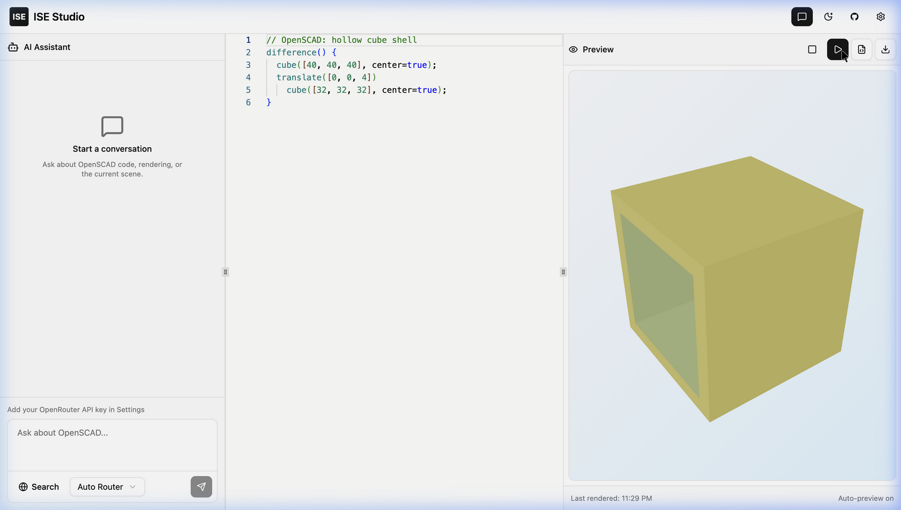

# ISE Studio

An open-source, browser-based IDE for OpenSCAD with AI-powered coding assistance. Write, compile, and preview 3D models directly in your browser using the official OpenSCAD compiler via WebAssembly.



Built with **Vite**, **React 19**, **TypeScript**, **Monaco Editor**, and **shadcn/ui**.

## Features

🚀 **Native OpenSCAD Support**

- Full OpenSCAD language support with real compiler via WebAssembly
- Monaco Editor with syntax highlighting and code intelligence
- Live compilation with auto-preview (debounced for performance)
- Direct STL and OBJ export from OpenSCAD models
- Responsive resizable layout

🤖 **AI-Powered Development**

- Interactive AI chat assistant powered by OpenRouter
- Tool-based AI workflows with code validation and modification
- Search OpenSCAD documentation in context
- AI-assisted code editing with selection awareness
- Bring your own API key (no backend required)
- Agentic function calling for intelligent code suggestions

🎨 **Modern UI**

- Built with shadcn/ui components  
- Dark/light theme support
- Keyboard shortcuts (Ctrl+Shift+C for chat toggle, F5 for render)
- Accessible and responsive design
- Clean, distraction-free interface

⚡ **Performance**

- Built with Vite + React 19
- TypeScript for full type safety
- Tailwind CSS with utility-first styling
- Web Workers for compilation without blocking UI
- CORS-enabled WASM execution with COOP/COEP headers

## Getting Started

### Prerequisites

- Node.js 18+ or Bun
- An API key from OpenRouter (supports OpenAI, Anthropic, Google, and 200+ models)

### Installation

1. Clone the repository:

```bash
git clone https://github.com/yourusername/ise-studio.git
cd ise-studio
```

2. Install dependencies:

```bash
bun install
# or
npm install
```

3. Run the development server:

```bash
bun dev
# or
npm run dev
```

4. Open [http://localhost:5173](http://localhost:5173) in your browser.

### Setting Up AI Features

1. Click **Settings** in the top right of the header
2. Paste your OpenRouter API key
3. Select a model (defaults to Claude 3.5 Sonnet)
4. Start using AI-assisted coding!

Your API key is stored securely in your browser's local storage and sent directly to OpenRouter—no backend server needed.

## Architecture

ISE Studio uses a client-first architecture:

- **OpenSCAD Compilation**: Official OpenSCAD compiler compiled to WebAssembly
- **Web Workers**: Compilation runs in a background worker to keep the UI responsive
- **3D Rendering**: Three.js renders STL/OBJ geometry data from the compiler
- **AI Integration**: OpenRouter API handles all LLM requests with tool calling support
- **Local Tools**: Validate syntax, inspect geometry, search docs, and apply code patches via AI functions

## Tech Stack

- **Frontend**: Vite 7 + React 19 + TypeScript
- **Editor**: Monaco Editor with OpenSCAD language support
- **Styling**: Tailwind CSS 4 + shadcn/ui components
- **3D Rendering**: Three.js + React Three Fiber
- **OpenSCAD Compiler**: Official OpenSCAD compiled to WebAssembly
- **Geometry Parsing**: OBJ and STL parser for WASM output
- **AI**: OpenRouter API with agentic function calling
- **Icons**: Lucide React
- **Build Tools**: Vite with worker and WASM support

## Project Structure

```
src/
├── App.tsx                    # Main application component
├── main.tsx                   # Browser entry point
├── components/
│   ├── ide/
│   │   ├── ide-layout.tsx     # Main IDE layout with panels
│   │   ├── ide-header.tsx     # Header with theme toggle
│   │   ├── code-editor.tsx    # Monaco editor with selection tracking
│   │   ├── preview-panel.tsx  # Preview pane with compile controls
│   │   ├── scad-viewer.tsx    # 3D viewer for compiled geometry
│   │   ├── ai-chat.tsx        # AI assistant chat panel
│   │   └── file-explorer.tsx  # File tree (future)
│   ├── ai-elements/           # AI chat UI components
│   └── ui/                    # shadcn/ui components
├── lib/
│   ├── openscad-runner.ts     # WASM compiler interface
│   ├── off-parser.ts          # OBJ format parser
│   ├── ai-client.ts           # OpenRouter API integration
│   ├── ai-tools.ts            # AI tool definitions and handlers
│   ├── openscad-docs.ts       # OpenSCAD documentation data
│   ├── openscad-monaco.ts     # Monaco language support
│   ├── ai-settings.ts         # Settings persistence
│   └── utils/                 # Utility functions
├── workers/
│   └── openscad-worker.ts     # Web Worker for compilation
└── styles/                    # Global styles
```

## AI Tools & Workflows

ISE Studio provides AI-powered tools that enable intelligent code modifications:

- **`validate_dsl`**: Check OpenSCAD syntax and compilation errors
- **`inspect_scene`**: Analyze the compiled geometry (bounds, face count, etc.)
- **`search_docs`**: Search OpenSCAD documentation for functions and examples
- **`apply_patch_to_selection`**: Apply code edits to the current selection or whole document
- **`openrouter:web_search`**: Optional web search for external references

The AI assistant can chain these tools together to help you write, debug, and optimize OpenSCAD code.

## Roadmap

- [ ] File explorer with project management
- [ ] Multi-file support with imports
- [ ] Collaborative editing with Yjs
- [ ] Custom themes and editor configurations
- [ ] Performance profiling and optimization tips
- [ ] Community snippet library
- [ ] Desktop app via Tauri
- [ ] VS Code extension
- [ ] GPU-accelerated preview for complex models

## Contributing

We welcome contributions! Please see our [Contributing Guide](CONTRIBUTING.md) for details.

1. Fork the repository
2. Create your feature branch (`git checkout -b feature/amazing-feature`)
3. Commit your changes (`git commit -m 'Add some amazing feature'`)
4. Push to the branch (`git push origin feature/amazing-feature`)
5. Open a Pull Request

## License

This project is licensed under the MIT License - see the [LICENSE](LICENSE) file for details.

## Acknowledgments

**Special thanks to the [OpenSCAD Playground](https://github.com/openscad/openscad-playground) project** for pioneering browser-based OpenSCAD editing and the compilation architecture that inspired ISE Studio.

We also extend our gratitude to:

- [OpenSCAD](https://openscad.org/) - The amazing 3D modeling language
- [shadcn/ui](https://ui.shadcn.com/) - Beautiful, accessible UI components
- [Monaco Editor](https://microsoft.github.io/monaco-editor/) - Professional code editor
- [Three.js](https://threejs.org/) - 3D graphics library
- [OpenRouter](https://openrouter.ai/) - Unified LLM API
- The open-source community for all the amazing tools and libraries

## Support

If you like this project, please consider:

- ⭐ Starring the repository
- 🐛 Reporting bugs and issues
- 💡 Suggesting new features
- 🤝 Contributing to the codebase

---

Built with ❤️ by the open-source community
